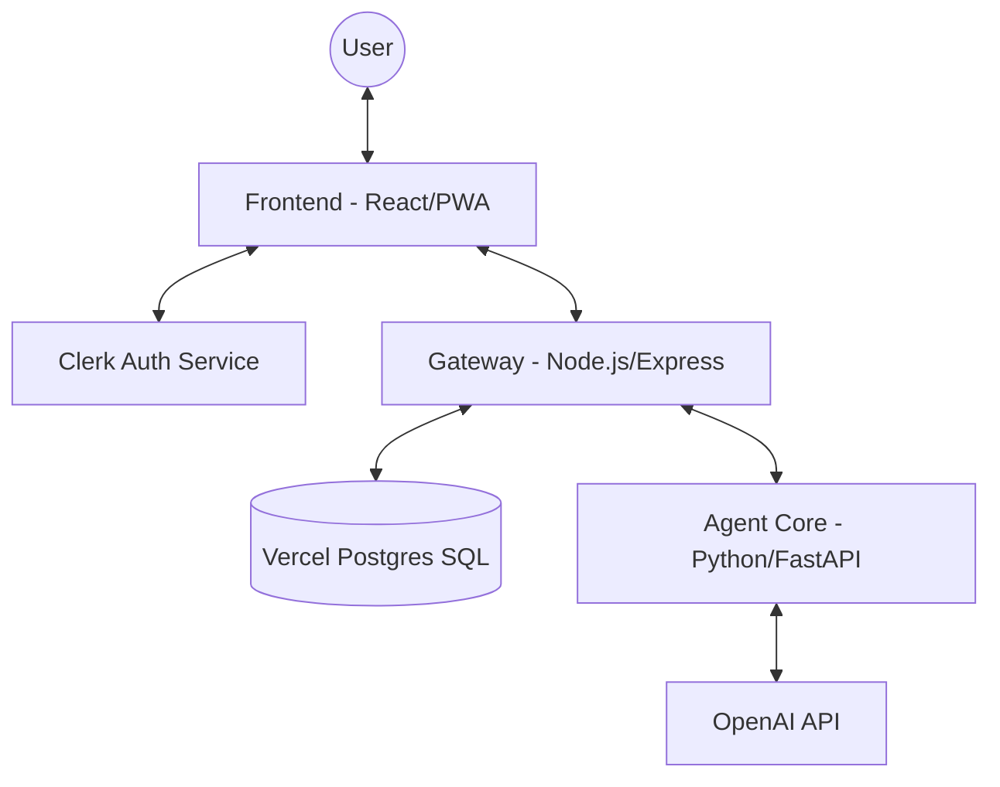

# InnerLoop.ai — Your Thoughts Deserve Memory

**InnerLoop.ai** is a premium, voice-first AI companion designed for deep reflection and long-term continuity. Built for founders, engineers, and overthinkers, InnerLoop remembers what matters about you and helps you think clearly—every day.

---

## 🎯 The Problem

In a world of "infinite scroll" and constant notifications, humans have lost the ability to **think in loops**. 
- **Fragmented Thoughts**: Important realizations are often lost in Slack, notes apps, or forgotten entirely.
- **Decision Fatigue**: Without a record of emotional and mental state during past decisions, we repeat the same mistakes.
- **Knowledge Silos**: Personal wisdom is rarely structured or accessible for long-term growth.

InnerLoop.ai solves this by providing a **dedicated sanctuary for reflection** that never forgets.

## 💡 How it Solves It

InnerLoop uses a **voice-first, memory-anchored workflow**:
1. **Talk**: You speak your thoughts naturally. No worrying about "formatting" or "grammar."
2. **Reflect**: The AI (Agent Core) mirrors your thoughts, identifying core themes and potential "memories."
3. **Commit**: You approve specific "memories" (Decisions, Emotions, Goals).
4. **Link**: Over time, InnerLoop connects today's reflection with a decision you made 3 weeks ago, providing unprecedented cognitive continuity.

### 💰 Does it save Time & Money?
- **Saves Time**: Eliminates the "blank page" syndrome of journaling. A 2-minute voice reflection is equivalent to 15 minutes of typing.
- **Saves Money**: By tracking "Decision Quality," users avoid high-cost emotional financial decisions and redundant software/lifestyle subscriptions by staying aligned with their actual goals.

---

## 🏗️ Software Architecture & System Design

InnerLoop is a **distributed hybrid system** designed for privacy and low-latency interaction.

### 🧩 High-Level System Design

### 📡 Data Flow
1. **Ingestion**: Voice data is transcribed and sent to the **Gateway**.
2. **Analysis**: The Gateway passes the text to the **Agent Core**, which runs an ensemble of "Reflection" and "Memory Extraction" prompts.
3. **Storage**: Approved memories are stored in **Vercel Postgres** with high relational integrity for future querying.
4. **Synthesis**: Every 7 days, a "Summary Agent" scans the week's memories to generate a holistic report.

---

## ✨ Key Features

- **🎙️ Voice-First Reflection**: A calm, push-to-talk interface designed for daily thinking loops.
- **🧠 Trust-Based Memory**: InnerLoop only remembers what you explicitly approve.
- **📊 Weekly Summaries**: Automatic reflections on your emotional and cognitive patterns.
- **🛡️ Zero Hallucination**: AI responses are grounded strictly in your actual conversations.

---

## 🛠️ Technology Stack

| Layer | Technologies |
| :--- | :--- |
| **Frontend** | React 18, Vite, TypeScript, Tailwind CSS, Framer Motion, TanStack Query |
| **Backend Gateway** | Node.js, Express, Clerk SDK, @vercel/postgres |
| **AI Agent Core** | Python 3.11, FastAPI, OpenAI SDK |
| **Infrastructure** | Vercel (Frontend/DB), Railway/Render (Backend) |

---

## 🚀 Local Development

### Prerequisites
- Node.js >= 18 | Python >= 3.10
- Clerk API Keys | Vercel Postgres URL

### Setup
1. **Agent Core**: `cd agents && pip install -r requirements.txt && uvicorn main:app`
2. **Gateway**: `cd gateway && npm install && npm run dev`
3. **Frontend**: `cd frontend && npm install && npm run dev`

---

## 🔒 Privacy & Philosophy

- **Trust > Intelligence**: We never turn your thoughts into data fodder.
- **Reflection > Advice**: We mirror your thinking instead of prescribing fixes.
- **Depth > Virality**: No feeds, no dopamine loops. Just depth and continuity.

Built with ❤️ by [Harsh](https://github.com/harshmriduhash)

